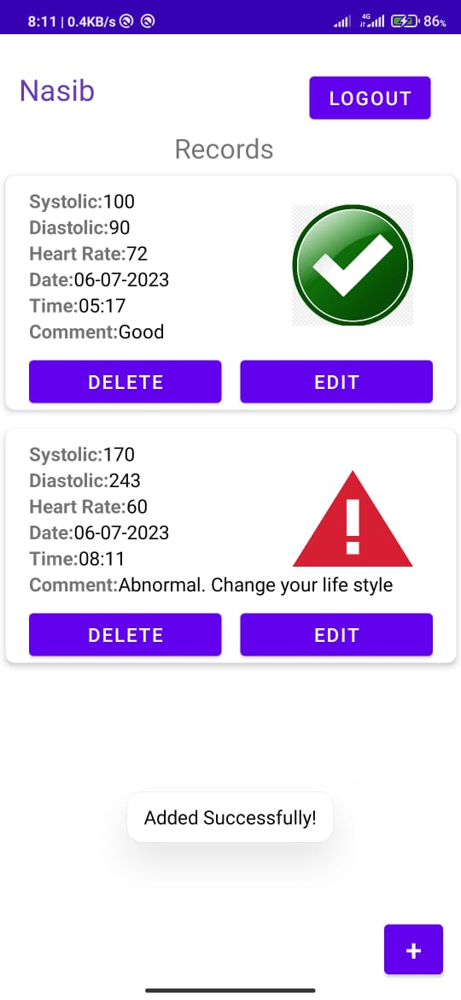
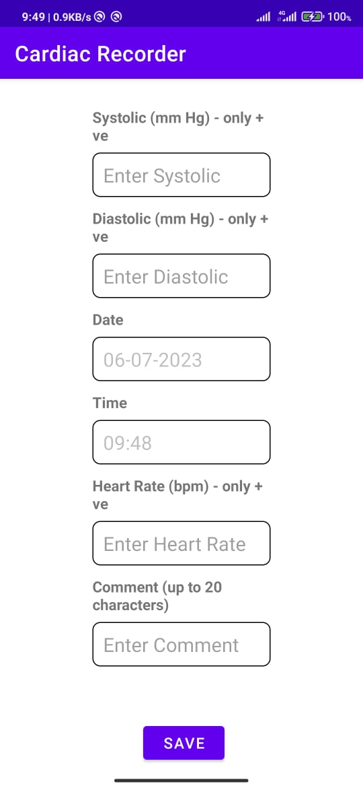
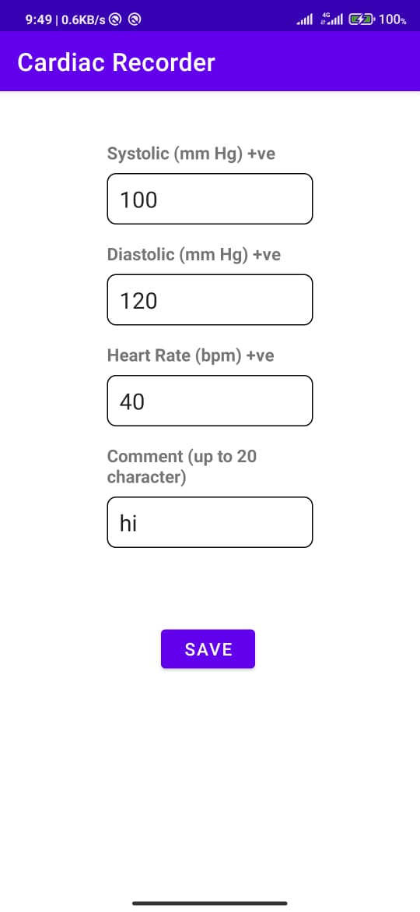

# CardiacRecorder

CardiacRecorder is a simple Android app designed to help users taking decision on the basis of some data like heart rate, systolic and diastolic entered by the user. It highlights or flags unusual blood pressure readings.

## Contributers
| Name          | GitHub Profile                  |
| ------------- | ------------------------------- |
| Abdulla      | [abdulla30r](https://github.com/abdulla30r)     |
| Rakibul Nasib   | [nasib1026](https://github.com/nasib1026) |

## Features

- Show a list of heart related records with date, time, systolic pressure, diastolic pressure, heart rate, and comment fields.
- Add a new measurement, which gets added to the end of the list.
- View and edit the details of an existing record.
- Remove a record.
- Highlight or flag unusual blood pressure readings outside the normal range.

## Installation

1. Clone or download the CardiacRecorder project from GitHub.
2. Open the project in Android Studio or any capable compiler.
3. Connect an Android device or use an emulator.
4. Build and run the app on the device.

## Usage

1. Upon launching the app you will see a sign in page with an option to register(if you are a new user)
1. Then you will see a list of your blood pressure and heart rate measurements(empty in case of new user).
2. To add a new measurement, tap the "+" button and enter the required information.
3. To view or edit a measurement, tap on it in the list and make the necessary changes.
4. To delete a measurement,click on the delete button and delete it.
5. Unusual blood pressure readings will be highlighted or flagged for easy identification.

## Screenshots
<table>
  <tr>
    <td>
      
    </td>
    <td>
      
    </td>
    <td>
      
    </td>
    
  </tr>
  <tr>
    <td>
      
    </td>
    <td>
      
    </td>
    <td>
      
    </td>
   
  </tr>
</table>

## Final Project Video
- [Project Video]([https://your-project-documentation.com](https://youtube.com/shorts/Oz88JLy2tsA?feature=share)

## Testing Videos(Unit,UI)
- [Unit testing](https://youtu.be/xSAlqjntpGI)
- [UI testing](https://youtu.be/wIJIvs94n2E)
## Contributing

Contributions to CardiacRecorder are welcome! If you have any bug reports, feature requests, or improvements, please submit them as issues or pull requests on the GitHub repository.

